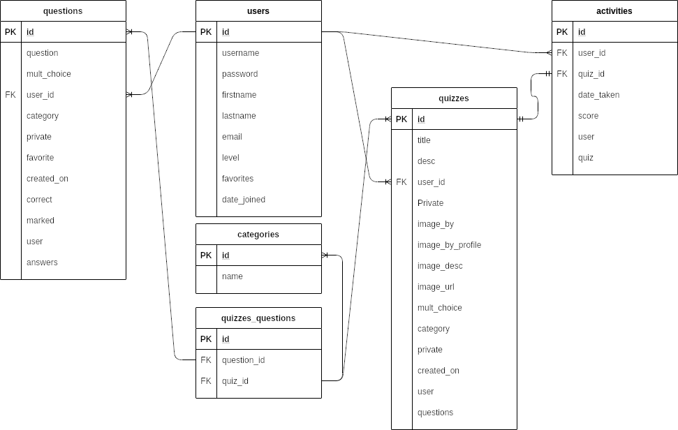
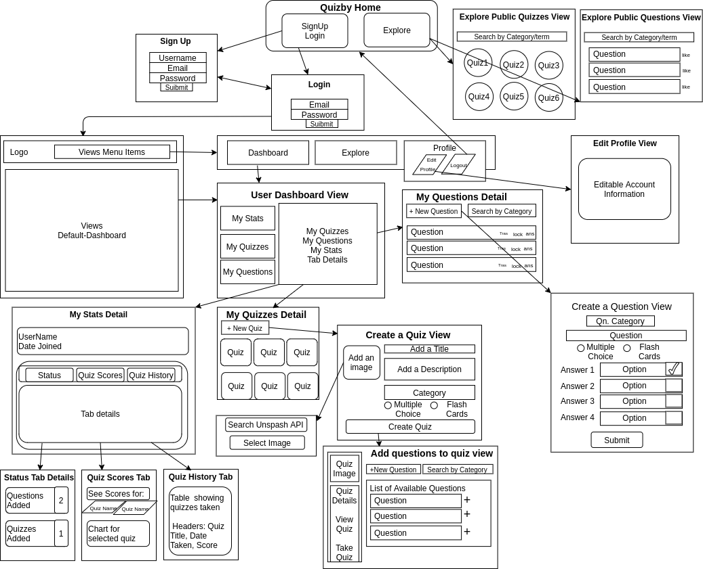

# Quizby App

A system for managing online multiple-choice tests. Supports editing of questions by whoever is in charge of the test, creation of tests from the available set of questions or using pre-built quizzes. Correct Answers and scores are provided at the end of the test.

### Goals:
- Allow a user sign up/login
- Allow a user to create a quiz, a question or add questions manually 
- The user can create a quiz from the available questions and practice. 
- Display correct answers at the end of each quiz session.
- If the user has all private quizzes, the leaderboard will show the best score quiz-wise for that user only.
- The user has a choice to make the quiz public or private. Making it public will allow other users to take that quiz. 

## Starting the Application

1. Download the code via zip file or clone the repo
2. In the virtual environment, install dependencies with `python install -r requirements.txt `
3. Add environment variables (See below for the variables list) to `secrets.py`
3. Run application with `flask run`
## Tech Stack:

- Python-Flask
- Postgres
- Javascript

## Environment Variables:

- CURR_USER_KEY - **string name to hold current user info**
- SECRET_KEY - **any string**
- DATABASE_URL - **string url for postgres database**
- UNSPLASH_API_KEY - **string- API key**
- UNSPLASH_API_URL - **string - API URL**

## API used:

[Unsplash API](https://unsplash.com/documentation#getting-started)

### Database Schema:

### User Model:

## Routes

#### login routes
  - *GET '/'*  
	  - Render Homepage based on user status
  - *GET '/login'*  
 	  - Render login form
  - *POST '/login'*  
 	  - Validate login info and reroute to '/'
  - *GET '/signup'*
    - Render Signup form  
  - *POST '/signup'*
    - Validate Signup and reroute to '/'
  - *GET '/logout'*
    - Reroute to '/' 
#### User routes
  - *GET '/users/profile'*
    - Display info about user
  - *GET '/users/profile/edit'*
    - Display form to edit user's profile
  - *POST '/users/profile/edit'*
    - Verify password on form submit and reroute to '/users/profile'
  - *GET '/users/<int:user_id>/quizzes'*
    - Display all quizzes created by the user
  - *GET '/users/<int:user_id>/questions'*
    - Display all questions added by the user
#### Quizzes routes
  - *GET '/create'*
    - Display create a quiz form
  - *POST '/create'*
    - Reroute to Adding questions page '/questions'
  - *GET '/quizzes/<int:quiz_id>/delete'
	- Delete quiz with the provided id
  - *GET '/search'*
    - Render search modal for image
  - *POST '/search'*
    - Get selected image and return to create quiz page
  - *GET '/search/unsplash'*
    - Search the unsplash API for images based on term entered
#### Questions routes
  - *GET '/questions'*
    - Display list of questions
  - *GET '/questions/add'*
    - Display form to add questions
  - *POST '/questions/add'*
    - Add question to database and reroute to '/questions'
  - *POST '/questions/<int:question_id>/delete'*
    - Delete a user's question
	

## Tests

Run tests with `python -m unittest`